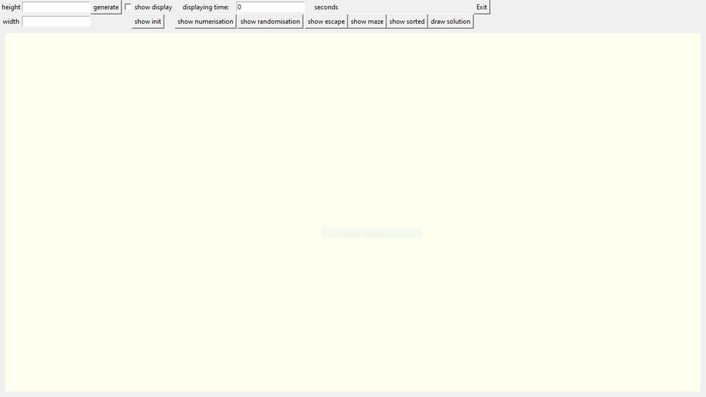
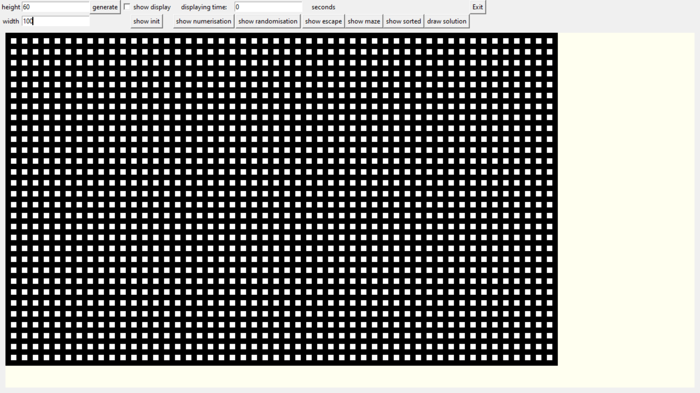
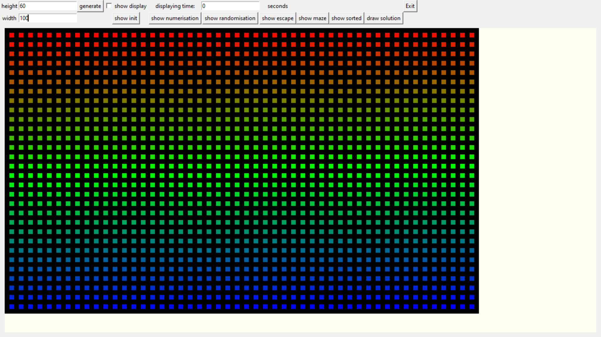
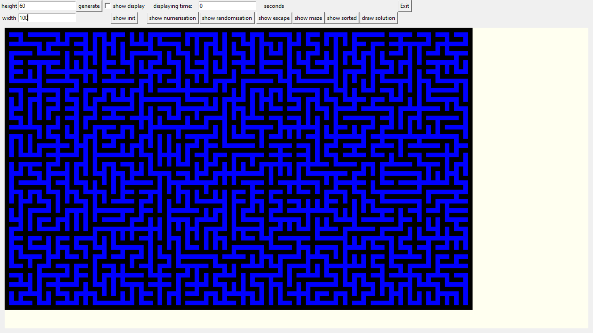
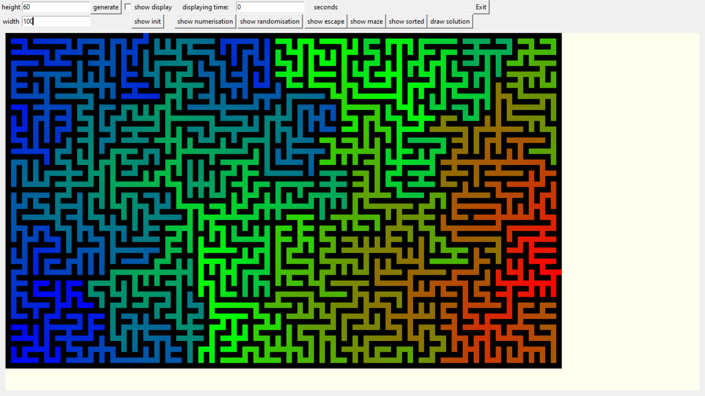
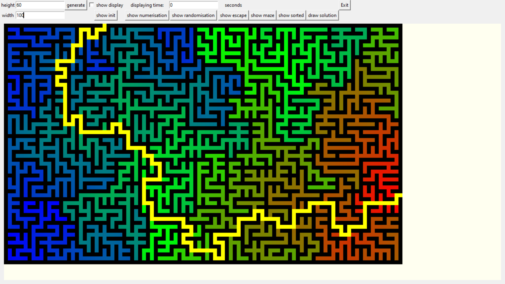

# Maze Project

Create a random maze with the solution based on user height and width inputs.

## Objective

This project is done on my personal time with the aim of improving my logical and practical skills by practicing on Python.
<ul>
<li>Develop skills in Python</li>
<li>Learn the Tkinter module</li>
<li>Learn maze creation logic</li>
<li>Learn maze solving logic</li>
<li>Create a visual and interactive interface with the user</li>
</ul>

## Usages

Execute with: <code>./maze.py</code>

1) will give you the home page:

2) Add a positive integer in "height" and "width" to initialise the size of the maze, then click on generate. A progress bar will appeard. it can take a long time if you give a big size to the maze. Try with height = 60 and width = 100

3) Click on the "show init" button. It will show you how the maze is initialised.

4) Click on the "show numerisation" button. It will show you how the maze is numezised.

4) Click on the "show randomisation" button. It will show you how the maze is randomised. You can active the checkbox "show display", it will show you how the program create a random maze.

4) Click on the "show escape" button. It will show you two red escape.

4) Click on the "show maze" button. It will show you the entire maze.

4) Click on the "show sorted" button. It will show you the sorted maze used to solve the maze. You can active the checkbox "show display", it will show you how the program sort a maze.

4) Click on the "draw solution" button. It will show you the solution of the maze.

## Versions

### 0.0
Execute with: <code>./maze.py</code>
<ul>
<li>Create a random matrix that represent a square maze</li>
<li>Display the maze on a Tkinter window</li>
</ul>

### 0.1
Execute with: <code>./maze.py</code>
<ul>
<li>Implement a height and width for the maze</li>
<li>Implement the solving solution and draw the path solution</li>
</ul>

### 0.2
Execute with: <code>./models/maze.py</code>

Not stable version
<ul>
<li>Add graphic interface</li>
<li>Add view buttons</li>
<li>Add a "show display" button to let the user choose to display the processing method for each of the generated mazes</li>
</ul>

### 0.3
Execute with: <code>./maze.py</code>

<ul>
<li>Add classes</li>
<li>Add loading bar</li>
<li>Improve the display time on Tkinter</li>
<li>Generate a random start and end</li>
</ul>
